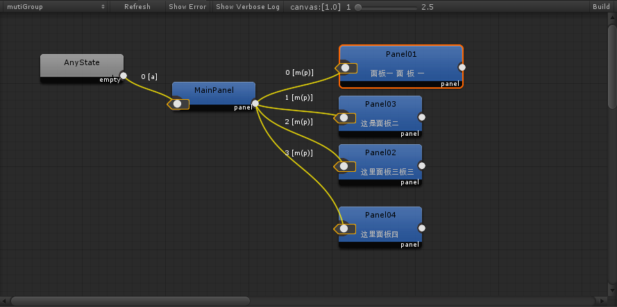
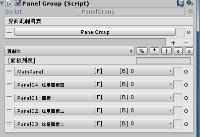
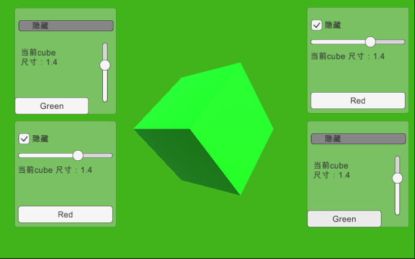
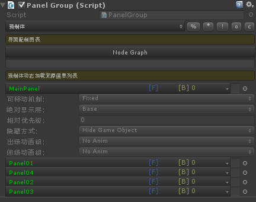
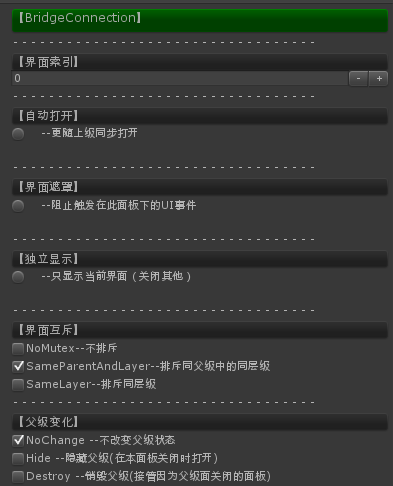

BridgeUI-综合性UGUI框架
=====================

----基于Unity3d及UGUI,结合编辑器扩展之节点图制作而成的利于编辑,接口简洁的人性化界面框架.

- **节点编辑器取自AssetBundleGraph**
- **分离界面自身属性及界面关联属性**
- **分离属性的设置及预制体的制作**
- **支持双定义层级,即基本层级类型和int型层级**
- **支持打开动画及关闭动画的编辑器状态指定**
- **独立程序核心逻辑与界面生成**
- **支持面板间互斥不同时显示功能**
- **支持编辑器模式快速打开面板及批量保存功能**
- **支持xLua文本各种加载方式**
- **支持mvvm模式，可动态绑定viewModel**
- **支持viewModel控制多个view**
- **支持代码生成与更新，解析与重写**
- **支持一键切换资源包或预制体加载**
- **支持同时加载资源包和预制体
- **支持运行时加载面板间关联**

## 注意
（需要同时下载：）
（主分支仅在unity最新版本开发及测试！）
-------------------
## 接口

### 1.任意脚本中打开一个面板
```
var handle = UIFacade.Instence.Open(PanelName:string, data:object = null);
```
### 2.在面板中打开面板为子面板
```
var handle = this.Open(PanelName:string, data:object = null);
var handle = this.Open(id:int,data:object = null);
```
### 3.关闭所有对应名称的面板
```
UIFacade.Instence.Close(PanelName:string);
```
### 4.隐藏所有对应名称的面板
```
UIFacade.Instence.Hide(PanelName:string);
```
### 5.注册界面打开事件
```
IUIHandle RegistCreate(UnityAction<IUIPanel> onCreate);
```
### 6.注册界面关闭事件
```
IUIHandle RegistClose(UnityAction<IUIPanel> onClose);
```
### 7.注册与注销界面信息回调
```
IUIHandle RegistCallBack(UnityAction<IUIPanel, object> onCallBack);
IUIHandle RemoveCallBack(UnityAction<IUIPanel, object> onCallBack);
```
### 8.定向发送信息
```
IUIHandle Send(object data);
```
----------
## 图形化
### 1.利用线来表示界面与界面之间的关系

### 2.将节点信息记录独立于Prefab

### 3.快速展开编辑和快速保存

### 4.自定义加载菜单

### 5.快速编辑预制体代码

### 6.定义界面关联与打开时的状态



## UML设计
### 1.Facade及生成器

### 2.界面类型信息模型

### 3.界面类型信息模型

### 4.连接器及句柄对象

### 5.MonoBehaiver


----------
## 开发过程
    实际上正确的流程应该是先设计好类与类之间的关系,然后进行具体的编程,但由于前期制作过了个简单的界面打开关闭的功能,并在实际使用过程中遇到一些急需解决的问题.因此在做这个框架的时候基本上就是想到什么就写什么了.最后才完善的这个UML类图(其实目前还是不能正确的生成脚本).下面是开发的过程,希望引以为戒.
### 1.找到一个合适的节点连接框架
    一开始就想设计成一个利于编辑和利用的界面管理器,所以找了不少开源的节点连接的框架,最开始用NodeEditorFrameWork,说真的它还能支持非编辑器模式,我开始幻想以后是不是可以开始一个用户可以指定界面打开规则的框架,然而在使用过程中发现其并不支持对连接线信息的记录和保存功能,而且线还不能点击,所以果断放弃(毕竟实在没兴趣把它改成可以点线...),这时选择了unity日本的一个AssetBundleGraph,这个工具在当时的unity2017大会上有人专门讲过,虽然这个框架写的非常好,基本上涵括了整个开发流程用到的东西,但实际开发中有太多的需要自定义,一直搁置在那没研究,这次倒用上了.
### 2.保留上一版框架的界面编辑功能
    虽然有了这样了个可以直观看到的编辑面板加载和关联的信息的壳子,但还是不能满足开发过程中需要时常编辑面板和代码的功能,所以果断把上一版本的绘制脚本拷贝过程改改直接用了.但由于上一板中用的支持多个面板组的功能在这种框架的基础上并没有太多存在的意义,最后就去掉了.同时由于不再需要在这个面板内进行信息修改,所以BridgeInfo的信息也没有绘制出来了.
### 3.将编辑器状态保存的信息转换到可运行时读取的信息
    一开始并不打算用两个数据模型来转换,想直接是所见就是所得,但AssetBundleGraph中的数据模型只支持编辑器模式,所以也没有改了(以后到是可以合并下).虽然这样不利也有一些好处,就是改的时候不一定应用,而且支持多个asset信息保存到一个PanelGroup中.
### 4.Bridge的思路来源
    上一板资源创建的方式是一开始就注册到事件中,需要创建和销毁的及隐藏的功能都是动态注册的事件,而且边信息传递的方式都是事件.这样的思路个人觉得对性能还是很好的,不应该不用每次创建或者删除都去找到相应的信息再进行操作.但这样也有个程序扩展性不好,可读性不高的问题.这次就直接放弃了这种方式.但如果不用事件系统那么信息传递和保留通道是个问题,最后才想到Bridge(桥)的解决方案,就是在面板打开过程中形成一个动态的Bridge对象,那么就可以通过这个对象进行一系列的操作了.因为这个框架是支持多个PanelGroup的,就是说你可能会同时打开两个一样名称的面板,那么你怎么能同时对两个面板发送信息呢.所以UIFacade中并没有返回Bridge而是返回了一个Handle,通过这个Handle就可以同时和几个Bridge通信了

## 后记
程序还在更新中，欢迎提意见！
