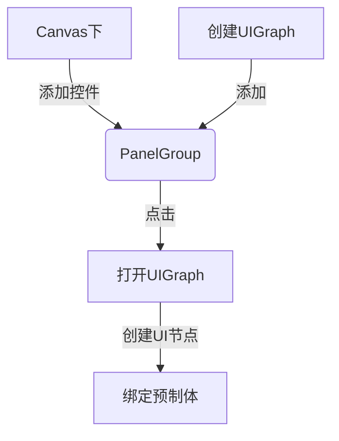

《BridgeUI》
=====================

（*基于UGUI的一款综合性UI交互框架*）

-------------------
### 一.主要特性
- **可视化UI节点编辑，直观明了**
- **分离界面开闭相关属性，及界面逻辑属性**
- **支持多层级。自带空间深度显示**
- **自带动画接口，可扩展并动态绑定**
- **支持面板间互斥，回滚等常见操作**
- **批量打开界面，及批量关闭保存更新预制体**
- **支持xLua文本各种加载方式（测试）**
- **基于mvvm模式，可动态绑定ViewModel**
- **支持非MVVM模式（厚View)**
- **分别缓存GameObject,及逻辑代码**
- **支持多种资源加载方式（Oringal,AssetBundle,Resources**
- **支持运行时加载面板关联组**
-------------------
### 二.下载注意
- 需要同时下载：
- 使用时请确保unity版本一致或更高
-------------------
### 三.主要接口 (IUIFacade)

- void Open(string panelName, object data = null);
- void Open(IUIPanel parentPanel, string panelName, object data = null);
- void Open(string panelName, IPanelVisitor uiData);
- void Open(IUIPanel parentPanel, string panelName, IPanelVisitor uiData);
- bool IsPanelOpen(string panelName);
- bool IsPanelOpen<T>(string panelName, out T[] panels);
- bool IsPanelOpen(IPanelGroup parentGroup, string panelName);
- bool IsPanelOpen<T>(IPanelGroup parentPanel, string panelName, out T[] panels);
- void Hide(string panelName);
- void Hide(IPanelGroup parentGroup, string panelName);
- void Close(string panelName);
- void Close(IPanelGroup parentGroup,string panelName);
- void RegistCreate(UnityAction<IUIPanel> onCreate);
- void RegistClose(UnityAction<IUIPanel> onClose);
- void RemoveCreate(UnityAction<IUIPanel> onCreate);
- void RemoveClose(UnityAction<IUIPanel> onClose);
(以上是IUIFacace提供的接口，除此之外还有IUIPanel,ViewModel等重要接口需要掌握后方能正确使用)
-------------------
### 四.使用流程

- 节点制作

- 其他功能
（可参考Demo）
-------------------
### 五.后记
由于github上传困难，本工程将不再维护，望周知！
